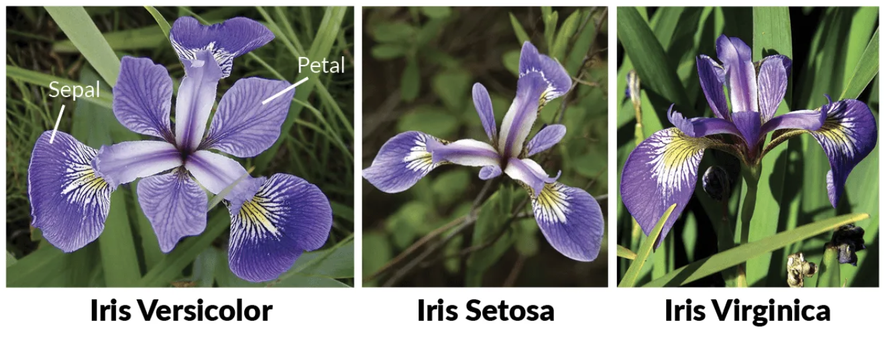

# Iris Flower Classification

## Project Overview
The Iris dataset is a popular and widely used dataset in the field of machine learning and data analysis. It contains measurements of various attributes of different species of Iris flowers. This dataset was first introduced by the British statistician and biologist Ronald Fisher in 1936 and has since become a standard benchmark for classification algorithms.




---

## Dataset Specifications
The dataset consists of **150 instances**, each representing an individual Iris flower. 

### Features & Attributes
Each instance contains four distinct numeric features (measured in centimeters):

| # | Feature Name | Description |
| :--- | :--- | :--- |
| **1** | Sepal Length | The measurement of the length of the sepal (the outer whorl of the flower). |
| **2** | Sepal Width | The measurement of the width of the sepal. |
| **3** | Petal Length | The measurement of the length of the petal (the inner whorl of the flower). |
| **4** | Petal Width | The measurement of the width of the petal. |

### Target Classes
Based on these four features, the model learns to accurately classify new Iris flowers into one of three distinct species:

1. **Setosa**
2. **Versicolor**
3. **Virginica**

---

## Project Goal
The ultimate goal of this project is to build, train, and evaluate a machine learning classification model that can accurately predict the species of an Iris flower based on its structural measurements.

<details>
<summary> <b>How to Run This Project (Click to expand)</b></summary>

### Prerequisites
Make sure you have Python installed, along with the required data libraries:
```bash
pip install numpy pandas scikit-learn matplotlib seaborn
```

### Execution
1. Open your terminal or command prompt in the project folder.
2. Launch the Jupyter Notebook environment:
   ```bash
   jupyter notebook
   ```
3. Open and run all the cells inside **`Iris.ipynb`**.
</details>